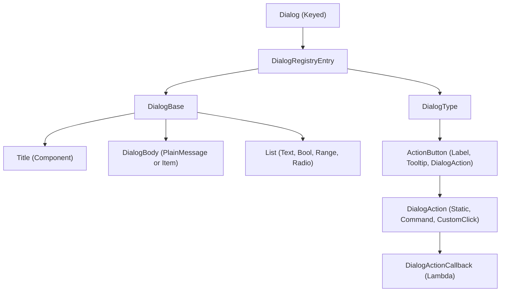

# Paper 26.1 Dialog API Reference

> [!IMPORTANT]
> The Dialog API is part of the `io.papermc.paper.registry.data.dialog` namespace and is marked with `@Experimental`. Classes, interfaces, and methods in this package are subject to change in future Paper versions.

---

## 1. Overview & Architecture

The Paper **Dialog API** provides a native, server-driven, GUI-like menu interface for players. Unlike classic inventory-based menus (such as Chest GUIs), Dialogs are rendered natively on the client using Minecraft's modern UI structures, allowing for inputs, button lists, notices, and links.

### The Dialog Lifecycle & Registry
A `Dialog` is a registry-backed object (`Keyed`). It can be obtained or defined in two ways:
1. **Dynamic Runtime Creation (Ad-hoc):** Using the static `Dialog.create(Consumer<RegistryBuilderFactory<Dialog, ? extends DialogRegistryEntry.Builder>>)` method during normal server runtime.
2. **Registry Bootstrap Event:** Hooking into `RegistryEvents.DIALOG` during server bootstrap to pre-register dialogs that can be retrieved via the `DIALOG` registry key.

### Core Architecture Component Flow


---

## 2. API Package Structure

### Core Package: `io.papermc.paper.dialog`
*   `Dialog`: The main interface representing a playable dialog. Extends `org.bukkit.Keyed` and Kyori Adventure's `net.kyori.adventure.dialog.DialogLike`.
*   `DialogResponseView`: Read-only view containing player inputs submitted from a dialog callback.

### Data Registry Package: `io.papermc.paper.registry.data.dialog`
*   `DialogRegistryEntry`: Represents the registered entry.
*   `DialogBase`: Stores the layout components (title, body, inputs, close/back action settings).
*   `ActionButton`: Represents an interactive button displayed in a dialog.

### Sub-packages:
*   `io.papermc.paper.registry.data.dialog.type`: Structural layout types (`NoticeType`, `ConfirmationType`, `MultiActionType`, `DialogListType`, `ServerLinksType`).
*   `io.papermc.paper.registry.data.dialog.body`: Content structures (`PlainMessageDialogBody`, `ItemDialogBody`).
*   `io.papermc.paper.registry.data.dialog.action`: Interactivity styles (`StaticAction`, `CommandTemplateAction`, `CustomClickAction`, `DialogActionCallback`).
*   `io.papermc.paper.registry.data.dialog.input`: Forms and inputs (`BooleanDialogInput`, `NumberRangeDialogInput`, `SingleOptionDialogInput`, `TextDialogInput`).

---

## 3. Complete Type Mappings & Signatures

### `io.papermc.paper.dialog`

#### `Dialog`
```java
public interface Dialog extends org.bukkit.Keyed, net.kyori.adventure.dialog.DialogLike {
    // Fields
    static final Dialog CUSTOM_OPTIONS;
    static final Dialog QUICK_ACTIONS;
    static final Dialog SERVER_LINKS;

    // Methods
    static Dialog create(Consumer<RegistryBuilderFactory<Dialog, ? extends DialogRegistryEntry.Builder>> value);
    @Deprecated NamespacedKey getKey();
    @Deprecated Key key();
}
```

#### `DialogResponseView`
```java
public interface DialogResponseView {
    @Nullable String getText(String key);
    @Nullable Boolean getBoolean(String key);
    @Nullable Float getFloat(String key);
    @Nullable BinaryTagHolder payload();
}
```

---

### `io.papermc.paper.registry.data.dialog`

#### `DialogRegistryEntry` & `Builder`
```java
public interface DialogRegistryEntry {
    DialogBase base();
    DialogType type();

    public static interface Builder extends DialogRegistryEntry, RegistryBuilder<Dialog> {
        DialogRegistryEntry.Builder base(DialogBase dialogBase);
        DialogRegistryEntry.Builder type(DialogType dialogType);
        RegistryValueSetBuilder<Dialog, DialogRegistryEntry.Builder> registryValueSet();
    }
}
```

#### `DialogBase` & `Builder`
```java
public interface DialogBase {
    Component title();
    DialogBody body();
    List<DialogInput> inputs();
    DialogAfterAction afterAction();

    // AfterAction Enum
    public enum DialogAfterAction {
        CLOSE,
        BACK;
    }

    static DialogBase.Builder builder(Component title);

    public static interface Builder {
        DialogBase.Builder title(Component title);
        DialogBase.Builder body(DialogBody body);
        DialogBase.Builder inputs(List<DialogInput> inputs);
        DialogBase.Builder afterAction(DialogBase.DialogAfterAction afterAction);
        DialogBase build();
    }
}
```

#### `ActionButton` & `Builder`
```java
public interface ActionButton {
    Component label();
    @Nullable Component tooltip();
    int width();
    DialogAction action();

    static ActionButton create(Component label, DialogAction action);
    static ActionButton.Builder builder(Component label);

    public static interface Builder {
        ActionButton.Builder label(Component label);
        ActionButton.Builder tooltip(@Nullable Component tooltip);
        ActionButton.Builder width(int width);
        ActionButton.Builder action(DialogAction action);
        ActionButton build();
    }
}
```

---

### `io.papermc.paper.registry.data.dialog.action`

#### `DialogAction`
```java
public sealed interface DialogAction permits CommandTemplateAction, CustomClickAction, StaticAction {
    static CommandTemplateAction commandTemplate(String template);
    static StaticAction staticAction(ClickEvent value);
    static CustomClickAction customClick(Key id, @Nullable BinaryTagHolder additions);
    static CustomClickAction customClick(DialogActionCallback callback, ClickCallback.Options options);
}
```

#### `DialogActionCallback`
```java
@FunctionalInterface
public interface DialogActionCallback {
    void accept(DialogResponseView response, Audience audience);
}
```

---

### `io.papermc.paper.registry.data.dialog.body`

#### `DialogBody`
```java
public sealed interface DialogBody permits ItemDialogBody, PlainMessageDialogBody {
    static PlainMessageDialogBody.Builder plainMessage(Component message);
    static ItemDialogBody.Builder item(ItemStack itemStack);
}
```

#### `PlainMessageDialogBody` & `Builder`
```java
public interface PlainMessageDialogBody extends DialogBody {
    Component message();
    public static interface Builder {
        PlainMessageDialogBody.Builder message(Component message);
        PlainMessageDialogBody build();
    }
}
```

#### `ItemDialogBody` & `Builder`
```java
public interface ItemDialogBody extends DialogBody {
    ItemStack item();
    public static interface Builder {
        ItemDialogBody.Builder item(ItemStack item);
        ItemDialogBody build();
    }
}
```

---

### `io.papermc.paper.registry.data.dialog.input`

#### `DialogInput`
```java
public sealed interface DialogInput permits BooleanDialogInput, NumberRangeDialogInput, SingleOptionDialogInput, TextDialogInput {
    String key();

    static BooleanDialogInput.Builder bool(String key, Component label);
    static BooleanDialogInput bool(String key, Component label, boolean initial, String onTrue, String onFalse);

    static NumberRangeDialogInput.Builder numberRange(String key, Component label, float start, float end);
    static NumberRangeDialogInput numberRange(String key, int width, Component label, String labelFormat, float start, float end, @Nullable Float initial, @Nullable Float step);

    static SingleOptionDialogInput.Builder singleOption(String key, Component label, List<SingleOptionDialogInput.OptionEntry> entries);
    static SingleOptionDialogInput singleOption(String key, int width, List<SingleOptionDialogInput.OptionEntry> entries, Component label, boolean labelVisible);

    static TextDialogInput.Builder text(String key, Component label);
    static TextDialogInput text(String key, int width, Component label, boolean labelVisible, String initial, int maxLength, @Nullable TextDialogInput.MultilineOptions multilineOptions);
}
```

#### `BooleanDialogInput` & `Builder`
```java
public interface BooleanDialogInput extends DialogInput {
    Component label();
    boolean initial();
    String onTrue();
    String onFalse();

    public static interface Builder {
        BooleanDialogInput.Builder label(Component label);
        BooleanDialogInput.Builder initial(boolean initial);
        BooleanDialogInput.Builder onTrue(String onTrue);
        BooleanDialogInput.Builder onFalse(String onFalse);
        BooleanDialogInput build();
    }
}
```

#### `NumberRangeDialogInput` & `Builder`
```java
public interface NumberRangeDialogInput extends DialogInput {
    int width();
    Component label();
    String labelFormat();
    float start();
    float end();
    @Nullable Float initial();
    @Nullable Float step();

    public static interface Builder {
        NumberRangeDialogInput.Builder width(int width);
        NumberRangeDialogInput.Builder label(Component label);
        NumberRangeDialogInput.Builder labelFormat(String labelFormat);
        NumberRangeDialogInput.Builder start(float start);
        NumberRangeDialogInput.Builder end(float end);
        NumberRangeDialogInput.Builder initial(@Nullable Float initial);
        NumberRangeDialogInput.Builder step(@Nullable Float step);
        NumberRangeDialogInput build();
    }
}
```

#### `SingleOptionDialogInput` & `Builder` & `OptionEntry`
```java
public interface SingleOptionDialogInput extends DialogInput {
    int width();
    List<SingleOptionDialogInput.OptionEntry> entries();
    Component label();
    boolean labelVisible();

    public static interface Builder {
        SingleOptionDialogInput.Builder width(int width);
        SingleOptionDialogInput.Builder entries(List<SingleOptionDialogInput.OptionEntry> entries);
        SingleOptionDialogInput.Builder label(Component label);
        SingleOptionDialogInput.Builder labelVisible(boolean labelVisible);
        SingleOptionDialogInput build();
    }

    public static interface OptionEntry {
        String id();
        @Nullable Component display();
        boolean initial();

        static SingleOptionDialogInput.OptionEntry create(String id, @Nullable Component display, boolean initial);
    }
}
```

#### `TextDialogInput` & `Builder` & `MultilineOptions`
```java
public interface TextDialogInput extends DialogInput {
    int width();
    Component label();
    boolean labelVisible();
    String initial();
    int maxLength();
    @Nullable TextDialogInput.MultilineOptions multilineOptions();

    public static interface Builder {
        TextDialogInput.Builder width(int width);
        TextDialogInput.Builder label(Component label);
        TextDialogInput.Builder labelVisible(boolean labelVisible);
        TextDialogInput.Builder initial(String initial);
        TextDialogInput.Builder maxLength(int maxLength);
        TextDialogInput.Builder multilineOptions(@Nullable TextDialogInput.MultilineOptions multilineOptions);
        TextDialogInput build();
    }

    public static interface MultilineOptions {
        int minLines();
        int maxLines();
    }
}
```

---

### `io.papermc.paper.registry.data.dialog.type`

#### `DialogType`
```java
public sealed interface DialogType permits ConfirmationType, DialogListType, MultiActionType, NoticeType, ServerLinksType {
    static ConfirmationType confirmation(ActionButton yesButton, ActionButton noButton);
    static NoticeType notice();
    static NoticeType notice(ActionButton action);
    static MultiActionType.Builder multiAction(List<ActionButton> actions);
    static MultiActionType multiAction(List<ActionButton> actions, @Nullable ActionButton exitAction, int columns);
    static DialogListType.Builder dialogList(RegistrySet<Dialog> dialogs);
    static DialogListType dialogList(RegistrySet<Dialog> dialogs, @Nullable ActionButton exitAction, int columns, int buttonWidth);
    static ServerLinksType serverLinks(@Nullable ActionButton exitAction, int columns, int buttonWidth);
}
```

#### `NoticeType`
```java
public interface NoticeType extends DialogType {
    ActionButton action();
}
```

#### `ConfirmationType`
```java
public interface ConfirmationType extends DialogType {
    ActionButton yesButton();
    ActionButton noButton();
}
```

#### `MultiActionType` & `Builder`
```java
public interface MultiActionType extends DialogType {
    List<ActionButton> actions();
    @Nullable ActionButton exitAction();
    int columns();

    public static interface Builder {
        MultiActionType.Builder exitAction(@Nullable ActionButton exitAction);
        MultiActionType.Builder columns(int columns);
        MultiActionType build();
    }
}
```

---

## 4. Showing Dialogs to Players

Any client-facing target implementing Adventure's `Audience` interface (most notably `org.bukkit.entity.Player`) supports displaying dialogs.

```java
Player player = ...;
Dialog dialog = ...;

player.showDialog(dialog);
```

---

## 5. Rich Code Examples

### Example 1: Dynamic Notice Dialog (Ad-hoc Runtime)
Displays a simple notice dialog with an item icon, plain message, and an OK button that fires a custom callback.

```java
import io.papermc.paper.dialog.Dialog;
import io.papermc.paper.registry.data.dialog.ActionButton;
import io.papermc.paper.registry.data.dialog.DialogBase;
import io.papermc.paper.registry.data.dialog.action.DialogAction;
import io.papermc.paper.registry.data.dialog.body.DialogBody;
import io.papermc.paper.registry.data.dialog.type.DialogType;
import net.kyori.adventure.text.Component;
import net.kyori.adventure.text.event.ClickCallback;
import org.bukkit.Material;
import org.bukkit.entity.Player;
import org.bukkit.inventory.ItemStack;

public void showWelcomeNotice(Player player) {
    Dialog welcomeDialog = Dialog.create(factory -> {
        var builder = factory.empty();

        // Base Configuration
        var base = DialogBase.builder(Component.text("Welcome to the Server!"))
            .body(DialogBody.item(new ItemStack(Material.GRASS_BLOCK)).build())
            .afterAction(DialogBase.DialogAfterAction.CLOSE)
            .build();

        // Action Config
        var okAction = DialogAction.customClick((response, audience) -> {
            audience.sendMessage(Component.text("Thanks for reading the notice!"));
        }, ClickCallback.Options.builder().lifetime(java.time.Duration.ofMinutes(2)).build());

        var okButton = ActionButton.builder(Component.text("Awesome!"))
            .tooltip(Component.text("Click to close this notice"))
            .action(okAction)
            .build();

        builder.base(base).type(DialogType.notice(okButton));
    });

    player.showDialog(welcomeDialog);
}
```

---

### Example 2: Interactive Confirmation Dialog
Creates a Yes/No confirmation dialog to confirm a high-risk player action (e.g., reset player level).

```java
import io.papermc.paper.dialog.Dialog;
import io.papermc.paper.registry.data.dialog.ActionButton;
import io.papermc.paper.registry.data.dialog.DialogBase;
import io.papermc.paper.registry.data.dialog.action.DialogAction;
import io.papermc.paper.registry.data.dialog.body.DialogBody;
import io.papermc.paper.registry.data.dialog.type.DialogType;
import net.kyori.adventure.text.Component;
import net.kyori.adventure.text.event.ClickCallback;
import net.kyori.adventure.text.format.NamedTextColor;
import org.bukkit.entity.Player;

public void confirmLevelReset(Player player) {
    Dialog confirmDialog = Dialog.create(factory -> {
        var builder = factory.empty();

        var base = DialogBase.builder(Component.text("Reset Character Level?"))
            .body(DialogBody.plainMessage(Component.text("This action is permanent and cannot be undone!")).build())
            .afterAction(DialogBase.DialogAfterAction.CLOSE)
            .build();

        // YES Action
        var yesAction = DialogAction.customClick((response, audience) -> {
            if (audience instanceof Player p) {
                p.setLevel(0);
                p.setExp(0);
                p.sendMessage(Component.text("Your character level has been reset.", NamedTextColor.GREEN));
            }
        }, ClickCallback.Options.builder().lifetime(java.time.Duration.ofSeconds(30)).build());

        var yesButton = ActionButton.builder(Component.text("Yes, Reset It"))
            .tooltip(Component.text("Warning: Irreversible!"))
            .action(yesAction)
            .build();

        // NO Action
        var noAction = DialogAction.customClick((response, audience) -> {
            audience.sendMessage(Component.text("Reset cancelled.", NamedTextColor.RED));
        }, ClickCallback.Options.builder().lifetime(java.time.Duration.ofSeconds(30)).build());

        var noButton = ActionButton.builder(Component.text("No, Cancel"))
            .action(noAction)
            .build();

        builder.base(base).type(DialogType.confirmation(yesButton, noButton));
    });

    player.showDialog(confirmDialog);
}
```

---

### Example 3: Dynamic MultiAction Form Dialog with User Inputs
A complex form containing a boolean check, a text field, and a slider. The click callback reads the player-submitted choices from the `DialogResponseView`.

```java
import io.papermc.paper.dialog.Dialog;
import io.papermc.paper.registry.data.dialog.ActionButton;
import io.papermc.paper.registry.data.dialog.DialogBase;
import io.papermc.paper.registry.data.dialog.action.DialogAction;
import io.papermc.paper.registry.data.dialog.body.DialogBody;
import io.papermc.paper.registry.data.dialog.input.DialogInput;
import io.papermc.paper.registry.data.dialog.type.DialogType;
import net.kyori.adventure.text.Component;
import net.kyori.adventure.text.event.ClickCallback;
import net.kyori.adventure.text.format.NamedTextColor;
import org.bukkit.entity.Player;

import java.util.List;

public void openGuildCreationForm(Player player) {
    Dialog formDialog = Dialog.create(factory -> {
        var builder = factory.empty();

        // Inputs Definition
        var guildNameInput = DialogInput.text("guild_name", Component.text("Guild Name"))
            .initial("My Awesome Guild")
            .maxLength(24)
            .build();

        var publicEnrollInput = DialogInput.bool("is_public", Component.text("Public Guild"))
            .initial(true)
            .build();

        var guildTaxInput = DialogInput.numberRange("guild_tax", Component.text("Tax Percentage"), 0f, 100f)
            .initial(5f)
            .step(1f)
            .build();

        var base = DialogBase.builder(Component.text("Guild Registration"))
            .body(DialogBody.plainMessage(Component.text("Please fill out the guild settings below:")).build())
            .inputs(List.of(guildNameInput, publicEnrollInput, guildTaxInput))
            .afterAction(DialogBase.DialogAfterAction.CLOSE)
            .build();

        // Submit Button Action
        var submitAction = DialogAction.customClick((response, audience) -> {
            String name = response.getText("guild_name");
            Boolean isPublic = response.getBoolean("is_public");
            Float tax = response.getFloat("guild_tax");

            if (name == null || name.isBlank()) {
                audience.sendMessage(Component.text("Invalid Guild Name!", NamedTextColor.RED));
                return;
            }

            audience.sendMessage(Component.text()
                .content("Guild registered successfully!\n")
                .color(NamedTextColor.GREEN)
                .append(Component.text("Name: " + name + "\n", NamedTextColor.YELLOW))
                .append(Component.text("Public Enrollment: " + isPublic + "\n", NamedTextColor.YELLOW))
                .append(Component.text("Tax Percentage: " + tax + "%", NamedTextColor.YELLOW))
                .build()
            );
        }, ClickCallback.Options.builder().lifetime(java.time.Duration.ofMinutes(5)).build());

        var submitButton = ActionButton.builder(Component.text("Create Guild"))
            .action(submitAction)
            .build();

        var exitButton = ActionButton.builder(Component.text("Exit"))
            .action(DialogAction.staticAction(net.kyori.adventure.text.event.ClickEvent.runCommand("/spawn")))
            .build();

        builder.base(base).type(DialogType.multiAction(List.of(submitButton), exitButton, 1));
    });

    player.showDialog(formDialog);
}
```

---

### Example 4: Pre-registering Dialogs during Server Bootstrap
Hooks into the Paper Lifecycle Event registry callbacks to register a persistent static dialog at startup.

```java
import io.papermc.paper.plugin.bootstrap.BootstrapContext;
import io.papermc.paper.plugin.bootstrap.PluginBootstrap;
import io.papermc.paper.registry.RegistryKey;
import io.papermc.paper.registry.TypedKey;
import io.papermc.paper.registry.event.RegistryEvents;
import io.papermc.paper.registry.data.dialog.DialogBase;
import io.papermc.paper.registry.data.dialog.type.DialogType;
import net.kyori.adventure.text.Component;
import org.bukkit.NamespacedKey;

public class MyPluginBootstrap implements PluginBootstrap {
    // The key used to fetch this dialog during runtime
    public static final TypedKey<io.papermc.paper.dialog.Dialog> SERVER_INFO_DIALOG_KEY = 
        TypedKey.create(RegistryKey.DIALOG, NamespacedKey.fromString("myplugin:server_info"));

    @Override
    public void bootstrap(BootstrapContext context) {
        context.getLifecycleManager().registerEventHandler(RegistryEvents.DIALOG.freeze().newHandler(event -> {
            event.registry().register(SERVER_INFO_DIALOG_KEY, builder -> {
                builder.base(DialogBase.builder(Component.text("Server Info"))
                    .body(io.papermc.paper.registry.data.dialog.body.DialogBody
                        .plainMessage(Component.text("Welcome to our custom server! Check our website: server.net")).build())
                    .build()
                ).type(DialogType.notice());
            });
        }));
    }
}
```

---

### Example 5: Retrieving a Pre-registered Dialog at Runtime
Shows how to fetch the pre-registered dialog from the registry and display it to a player.

```java
import org.bukkit.Bukkit;
import org.bukkit.Registry;
import org.bukkit.entity.Player;
import io.papermc.paper.dialog.Dialog;

public void showServerInfo(Player player) {
    // Retrieve the dialog from Bukkit's global registry
    Registry<Dialog> dialogRegistry = Bukkit.getRegistry(Dialog.class);
    if (dialogRegistry != null) {
        Dialog infoDialog = dialogRegistry.get(MyPluginBootstrap.SERVER_INFO_DIALOG_KEY.key());
        if (infoDialog != null) {
            player.showDialog(infoDialog);
            return;
        }
    }
    player.sendMessage("Server Info dialog is not registered!");
}
```
