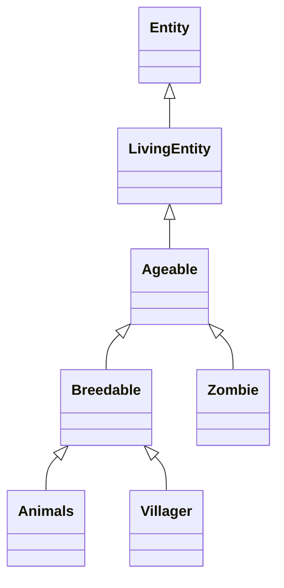

# Minecraft 26.1 "Tiny Takeover" Reference Guide
## Comprehensive Developer Reference: Mobs, Items, and Ageable API

> [!NOTE]
> This reference manual has been compiled for game developers and AI agents designing custom minigames and systems for the Paper/Spigot 26.1 ecosystem. It details the visual updates, audio revamps, custom behaviors, API mappings, and creative implementations for the "Tiny Takeover" update (released March 2026).

---

## Section 1: The Baby Mob Overhaul (42 Mobs)

The 26.1 "Tiny Takeover" update introduced a ground-up aesthetic and behavioral redesign for baby mobs. Previously, baby variants were simply downscaled clones of adult entities. In 26.1, they have been rebuilt with custom models, distinct rounder/chubbier proportions, oversized heads, non-pitch-shifted vocalizations, and unique mechanical interactions. 

Furthermore, **armor and saddles no longer render on baby variants** (e.g., Wolves, Pigs, Camels) to prevent clipping bugs, and **adult counterparts** of cows, pigs, sheep, and cats have been given randomized vocal "personalities" (including a rare chance to play the "classic" legacy sound).

---

### Part A: Farm & Domestic Mobs

#### 1. Cow (Calf)
*   **Visual Profile:** A plump, stout creature with a disproportionately large, blocky head, wide-set glossy dark eyes, and short legs. Its skin is a patchwork of chocolate-brown and cream, with a softer, velvety texture compared to the adult.
*   **Vocalizations:** Plays soft, squeaky "mews" and breathy, high-pitched moos. It has three distinct vocal variants assigned at spawn.
*   **Special Behaviors:** Displays a cute head-bobbing animation when holding wheat. Naturally clusters close to adult cows for protection.
*   **API Control Methods:** `org.bukkit.entity.Cow` implements `Ageable` and `Breedable`. Use `setBaby()` and `setAgeLock(true)` to maintain this form.
*   **Creative Minigame Idea:** **"Chonky Herding"**: Players use wheat to lead bobbing calves through an obstacle course. Calves have reduced friction and bounce off walls when collided with at speed.

#### 2. Mooshroom (Calf)
*   **Visual Profile:** A crimson-furred (or brown) calf covered in white spots, boasting two tiny, bulbous mushrooms sprouting from its back. Its eyes are large, obsidian beads that gleam in dark caves.
*   **Vocalizations:** A squeaky moo overlaid with a faint rustling, spore-like sound, giving it a mystical, squishy audio profile.
*   **Special Behaviors:** Leaves a trail of tiny red mushroom particles when running. Shearing it drops 2-3 small mushrooms and reverts it to a normal calf.
*   **API Control Methods:** Cast to `org.bukkit.entity.MushroomCow`. Get or set variant via `getVariant()` and `setVariant(MushroomCow.Variant)`.
*   **Creative Minigame Idea:** **"Mycelium Pathfinders"**: A puzzle game where baby Mooshrooms wander randomly. Players must place specific blocks to guide their particle trails across a grid to "fertilize" target zones.

#### 3. Sheep (Lamb)
*   **Visual Profile:** A literal cloud on legs. Its woolly fleece is puffy, round, and so thick that it forms a fluffy collar around its neck, leaving only its tiny pink nose and alert ears visible.
*   **Vocalizations:** High-pitched, vibrating bleats ("baa-aa-a") that warble slightly.
*   **Special Behaviors:** Eats grass block turf with a rapid, lawnmower-like head-twitching animation, instantly regenerating its fleece if sheared (though baby sheep yield no wool when sheared by players).
*   **API Control Methods:** `org.bukkit.entity.Sheep`. Color can be manipulated using `setColor(DyeColor)`.
*   **Creative Minigame Idea:** **"Cotton Ball Bounce"**: Dye baby sheep different colors. Use knockback sticks to bounce these fluffy cotton balls into corresponding colored pens before the timer runs out.

#### 4. Pig (Piglet)
*   **Visual Profile:** A tiny, rosy-pink oval body with a disproportionately massive flat snout and floppy ears that bounce when it runs. Its tail is a tight, curly corkscrew.
*   **Vocalizations:** Bubbly, squealing snorts and rapid, high-pitched oinks.
*   **Special Behaviors:** Attracted to carrots, potatoes, and beetroots. If struck by lightning, it transforms into a baby Zombified Piglin.
*   **API Control Methods:** `org.bukkit.entity.Pig`. Note that calling `setSaddle(true)` will set the internal NBT data but will not render the saddle on the piglet.
*   **Creative Minigame Idea:** **"Piglet Mudslide"**: Players use carrots on sticks to guide super-fast piglets down a water-logged mud slide, navigating sharp turns using steering mechanics.

#### 5. Cat (Kitten)
*   **Visual Profile:** Re-scaled in 26.1 to match baby ocelots, making them incredibly minute. They feature massive, glowing green/yellow eyes, a thin tail held upright like an antenna, and small twitching ears.
*   **Vocalizations:** Ultra-high-pitched, vibrating purrs and desperate, squeaky mews.
*   **Special Behaviors:** Will jump onto active furnaces, chests, or the foot of a sleeping player's bed. Scares away Creepers within a 6-block radius.
*   **API Control Methods:** `org.bukkit.entity.Cat`. Breeds are managed via `setCatType(Cat.Type)`. Collar colors are adjusted with `setCollarColor(DyeColor)`.
*   **Creative Minigame Idea:** **"Kitten Chaos"**: Kittens run loose in a mansion. Players must pick them up and place them on furnace blocks to warm them up, while avoiding creepers that are being actively repelled and scattered by the kittens.

#### 6. Ocelot (Baby Ocelot)
*   **Visual Profile:** A slender, camouflaged golden-yellow kitten covered in faint rosettes. It has an athletic build, a long, twitching tail, and wide, suspicious green eyes.
*   **Vocalizations:** Wild, raspy kitten hisses and soft, short mews.
*   **Special Behaviors:** Extremely skittish; will sprint away from any player who moves too fast or does not hold raw fish.
*   **API Control Methods:** `org.bukkit.entity.Ocelot`. Trust states are toggled via `setTrust(boolean)`.
*   **Creative Minigame Idea:** **"Jungle Stealth"**: An arena filled with thick foliage. Players must creep forward slowly and use fish to earn the trust of baby ocelots without triggering their panic sprint.

#### 7. Wolf (Puppy)
*   **Visual Profile:** A cute grey head with huge puppy eyes and a stubby tail. When tamed, it tilts its head when the player holds meat. Collar/armor does not render on the baby form.
*   **Vocalizations:** Playful, high-pitched yips and tiny, energetic barks.
*   **Special Behaviors:** Follows its owner and attacks targets. Begs for food when the player holds raw or cooked meat.
*   **API Control Methods:** `org.bukkit.entity.Wolf`. Tamed status is set via `setTamed(boolean)`.
*   **Creative Minigame Idea:** **"Fetch the Bone"**: A game where players throw custom bones (snowballs renamed "Bone"). Puppies chase the projectiles, pick them up (added to inventory), and return them to the owner.

#### 8. Chicken (Chick)
*   **Visual Profile:** A tiny yellow ball of fuzz, smaller than a single voxel block, with a minute orange beak and toothpick-thin legs.
*   **Vocalizations:** Rapid, high-pitched peeping and squeaky chirps.
*   **Special Behaviors:** Falls slowly due to its light weight, taking zero fall damage. Flaps its tiny wings furiously when airborne.
*   **API Control Methods:** `org.bukkit.entity.Chicken`.
*   **Creative Minigame Idea:** **"Chick Parachute"**: Players drop chicks from a sky platform and must place water buckets or use wind charges to blow them into high-value target rings on the ground.

#### 9. Rabbit (Baby Rabbit)
*   **Visual Profile:** A tiny, hopping cotton ball that fits in the palm of a hand. Can be brown, black, white, salt-and-pepper, or gold.
*   **Vocalizations:** Silent, but makes a tiny squeak when damaged.
*   **Special Behaviors:** Hops extremely fast. Flees from players and predators.
*   **API Control Methods:** `org.bukkit.entity.Rabbit`. Rabbit breed is managed with `setRabbitType(Rabbit.Type)`.
*   **Creative Minigame Idea:** **"Rabbit Garden Raid"**: Players must guide baby rabbits to carrot patches while protecting them from wild ocelots.

#### 10. Horse (Foal)
*   **Visual Profile:** A slender, long-legged foal with a soft mane and curious, wide eyes. Colors can be black, white, grey, brown, chestnut, or piebald.
*   **Vocalizations:** Soft, breathy whinnies and light, high-pitched snorts.
*   **Special Behaviors:** Stays close to its mother. Eats golden apples or golden carrots to speed up growth.
*   **API Control Methods:** `org.bukkit.entity.Horse` implements `Ageable` and `Breedable`. Set horse styles/colors via `setColor(Horse.Color)` and `setStyle(Horse.Style)`.
*   **Creative Minigame Idea:** **"Foal Obstacle Dash"**: A race where players must ride adult horses while keeping their unmounted foals following them closely through a jumping course.

---

### Part B: Undead Mobs

#### 11. Zombie (Baby Zombie)
*   **Visual Profile:** A pint-sized terror with decayed green skin, wearing a small, ragged shirt and pants. Its head is huge compared to its body, giving it a bobblehead look.
*   **Vocalizations:** Screechy, throat-tearing gurgles and high-pitched zombie moans.
*   **Special Behaviors:** Moves 30% faster than adults. Does not burn in sunlight. Can mount chickens, sheep, cows, pigs, or spiders to become a jockey.
*   **API Control Methods:** `org.bukkit.entity.Zombie`. Note that `Zombie` implements `Ageable` starting in recent API versions. Use `setBaby()` or `setAdult()`.
*   **Creative Minigame Idea:** **"Ankle Biter Tag"**: One player is chased by an ultra-fast baby zombie. If bitten, the player is infected and spawns their own baby zombie to chase others.

#### 12. Husk (Baby Husk)
*   **Visual Profile:** A small, dust-caked mummy wearing sun-bleached, sand-covered bandages. Its eyes glow with a dull, dried-red luminescence.
*   **Vocalizations:** Dry, raspy screeches and hollow, high-pitched groans of dehydration.
*   **Special Behaviors:** Fast-moving, sun-immune, and inflicts the Hunger effect on hit.
*   **API Control Methods:** `org.bukkit.entity.Husk`, which extends `Zombie`.
*   **Creative Minigame Idea:** **"Desert Desolation"**: Players navigate a desert maze while baby husks attack, constantly draining their hunger bar and forcing them to manage limited rations.

#### 13. Drowned (Baby Drowned / Gurgle)
*   **Visual Profile:** A waterlogged, teal-colored child zombie covered in dripping seaweed. Glowing cyan lines trace its skin.
*   **Vocalizations:** High-pitched, bubbling "gurgles" and wet, underwater screeches.
*   **Special Behaviors:** Swims extremely fast. Attacks with miniature tridents (if spawned with them). Sun-immune when submerged or raining.
*   **API Control Methods:** `org.bukkit.entity.Drowned`, which extends `Zombie`.
*   **Creative Minigame Idea:** **"Trench Trawler"**: An underwater defense game where players must build conduit beams to ward off waves of fast-swimming baby drowned.

#### 14. Zombie Villager (Baby Zombie Villager)
*   **Visual Profile:** A decaying, green-skinned child villager wearing tattered professional clothing. Its large nose is rotten and green.
*   **Vocalizations:** High-pitched, squeaky zombie groans mixed with villager grunts.
*   **Special Behaviors:** Hostile and fast. Can be cured by applying Weakness and feeding a Golden Apple, converting it back into a baby Villager.
*   **API Control Methods:** `org.bukkit.entity.ZombieVillager`. Professional robes are modified using `setVillagerProfession()`.
*   **Creative Minigame Idea:** **"Curing Clinic"**: A puzzle game where players must isolate, trap, and cure wave after wave of baby zombie villagers within a strict time limit.

#### 15. Zombie Horse (Foal)
*   **Visual Profile:** A small, rotting horse foal with dark green skin, exposed rib bones, and hollow black eyes. Bounding box expanded in 26.1 to match its visual model.
*   **Vocalizations:** Raspy, metallic neighs and skeletal jaw clicks.
*   **Special Behaviors:** Command-only spawn. Unlike regular horses, it is completely passive and **does not panic when hurt** in 26.1.
*   **API Control Methods:** `org.bukkit.entity.ZombieHorse`. It extends `AbstractHorse`.
*   **Creative Minigame Idea:** **"Grave Derby"**: A race where players ride baby zombie horses over obstacles. Because they don't panic or speed up when taking damage, players must rely purely on jumps and dashes.

#### 16. Skeleton Horse (Foal)
*   **Visual Profile:** A tiny, animated horse skeleton with a large skull, thin white bones, and glowing red pin-prick eyes.
*   **Vocalizations:** High-pitched bone rattling and dry whinnying.
*   **Special Behaviors:** Command-only spawn. Can be ridden underwater without drowning.
*   **API Control Methods:** `org.bukkit.entity.SkeletonHorse`.
*   **Creative Minigame Idea:** **"Deep Sea Jockey"**: A race taking place entirely on the ocean floor, where players ride baby skeleton horses through deep trenches and coral reefs.

---

### Part C: Nether Mobs

#### 17. Piglin (Baby Piglin)
*   **Visual Profile:** A golden-skinned, pig-eared child wearing a leather tunic. It has oversized floppy ears and wide, curious black eyes.
*   **Vocalizations:** High-pitched pig snorts and excited chatter.
*   **Special Behaviors:** Passive. Plays tag with other baby piglins. Will pick up gold items but **will not barter** (it keeps the gold!). Flees from soul fire and wither skeletons.
*   **API Control Methods:** `org.bukkit.entity.Piglin`. Use `setImmuneToZombification(boolean)` to keep it from converting in the Overworld.
*   **Creative Minigame Idea:** **"Gold Snatchers"**: Players must throw gold nuggets to distract baby piglins, who grab the gold and run away. Players must retrieve their gold before the piglins stash it.

#### 18. Zombified Piglin (Baby Zombified Piglin)
*   **Visual Profile:** A decaying pig-man child with exposed green bones on one side of its head and pink flesh on the other. It carries a miniature golden sword.
*   **Vocalizations:** High-pitched, hollow grunts and squeals.
*   **Special Behaviors:** Neutral until attacked. Extremely fast runner. Immune to fire and lava.
*   **API Control Methods:** `org.bukkit.entity.PigZombie`. Set zombification immunity using `setImmuneToZombification(boolean)`.
*   **Creative Minigame Idea:** **"Hellfire Minefield"**: Neutral baby zombified piglins pack a small platform. Players must cross the platform; hitting one piglin aggros the entire tiny, hyper-fast horde.

#### 19. Hoglin (Baby Hoglin)
*   **Visual Profile:** A small, red-skinned beast with a thick leather hide, oversized floppy ears, and tiny tusk buds protruding from its snout.
*   **Vocalizations:** High-pitched, throat-clearing snorts and piglet squeals.
*   **Special Behaviors:** Hostile but does low damage. Flees in terror if it detects Warped Fungi.
*   **API Control Methods:** `org.bukkit.entity.Hoglin`.
*   **Creative Minigame Idea:** **"Fungal Shepherd"**: Players hold warped fungi to scare and herd hostile baby hoglins into cages, using their fear mechanics as a steering wheel.

#### 20. Zoglin (Baby Zoglin)
*   **Visual Profile:** A rotting, green-skinned baby hoglin with exposed skull parts and blank white eyes.
*   **Vocalizations:** Decayed, wet snorts and screeching grunts.
*   **Special Behaviors:** Hostile to every single living entity except other Zoglins and Creepers.
*   **API Control Methods:** `org.bukkit.entity.Zoglin`.
*   **Creative Minigame Idea:** **"Zoglin Arena"**: Players are placed in an arena with baby zoglins. Players must use knockback to direct the zoglins to attack other monsters spawned in the arena.

#### 21. Strider (Baby Strider)
*   **Visual Profile:** A tiny, crimson cube with a flat head, purple spindly legs, and small tufts of hair. Shivers and turns a cold gray-blue when out of lava.
*   **Vocalizations:** High-pitched chattering and teeth-rattling noises.
*   **Special Behaviors:** Spawns riding on adult striders. In 26.1, **it inherits warmth from the strider it stands on**, remaining red and happy even if the top half of its body is exposed to cold air, matching Bedrock behavior.
*   **API Control Methods:** `org.bukkit.entity.Strider`. Check or set shivering status via `setShivering(boolean)`.
*   **Creative Minigame Idea:** **"Lava Stack Relay"**: A race across a lava ocean. Players must stack multiple baby striders on an adult strider and safely transport them across freezing air zones without letting them turn blue.

#### 22. Ghastling (Baby Ghast)
*   **Visual Profile:** A tiny, floating white cloud-cube (about 1x1x1 blocks) with miniature, stubby tentacles underneath. It has soft, teary eyes that look happy rather than sorrowful.
*   **Vocalizations:** Soft, high-pitched coos, light whines, and cat-like purring.
*   **Special Behaviors:** **Passive.** Obtained by placing a "Dried Ghast" block in water in the Overworld for 20 minutes (rehydration process). It imprints on the player and follows them. Feeding it snowballs grows it into a "Happy Ghast" (which is a peaceful, 4-player flying mount).
*   **API Control Methods:** In Bukkit, Ghastling is handled by spawning a custom `Ghast` and setting its size/attributes (such as `Attribute.GENERIC_SCALE` or setting custom NBT tag `IsBaby`).
*   **Creative Minigame Idea:** **"Ghastling Nursery"**: Players must protect floating Ghastlings from phantom attacks by shooting snowballs to heal them, while leading them to water pools.

---

### Part D: Aquatic & Amphibious Mobs

#### 23. Axolotl (Baby Axolotl)
*   **Visual Profile:** A minute salamander with a flat head, wide mouth, and feather-like pink external gills. Variants include Lucy (pink), Wild (brown), Gold, Cyan, and Blue.
*   **Vocalizations:** Tiny, bubbly water splashes and high-pitched squishes.
*   **Special Behaviors:** Passive to players. Attacks fish, squid, drowned, and guardians. Plays dead when hurt to gain Regeneration.
*   **API Control Methods:** `org.bukkit.entity.Axolotl`. Colors are managed via `setVariant(Axolotl.Variant)`.
*   **Creative Minigame Idea:** **"Pond Protectors"**: Send waves of baby axolotls to defend a coral reef against baby drowned. Players throw tropical fish to heal their tiny defenders.

#### 24. Dolphin (Baby Dolphin)
*   **Visual Profile:** A sleek, light-grey miniature dolphin with a cute rounded snout and glossy eyes.
*   **Vocalizations:** High-pitched, clicking whistles and bubbly squeaks.
*   **Special Behaviors:** Leaps out of the water. Gives players swimming nearby the Dolphin's Grace effect. Follows boats.
*   **API Control Methods:** `org.bukkit.entity.Dolphin`.
*   **Creative Minigame Idea:** **"Dolphin Hoop Run"**: Players use raw fish to guide leaping baby dolphins through floating rings suspended above a race track.

#### 25. Squid (Baby Squid)
*   **Visual Profile:** A dark-blue, blocky baby cephalopod with eight tiny, flapping tentacles and large, cartoonish eyes.
*   **Vocalizations:** Soft, squishy splashes.
*   **Special Behaviors:** Shoots dark ink clouds when attacked or when its ink sac is harvested.
*   **API Control Methods:** `org.bukkit.entity.Squid`.
*   **Creative Minigame Idea:** **"Squid Blindness"**: A swimming race in a pitch-black aquarium where players must avoid colliding with baby squids, which release blinding ink when bumped.

#### 26. Glow Squid (Baby Glow Squid)
*   **Visual Profile:** A glowing, luminescent cyan baby squid that emits sparkling, star-like neon particles.
*   **Vocalizations:** Magical, shimmering hums.
*   **Special Behaviors:** Emits light particles. Stops glowing for a few seconds when attacked.
*   **API Control Methods:** `org.bukkit.entity.GlowSquid`.
*   **Creative Minigame Idea:** **"Neon Night Swim"**: A dark maze where the path is illuminated only by the moving trails of baby glow squids. Players must guide them to light up the correct exit.

#### 27. Turtle (Baby Turtle)
*   **Visual Profile:** An incredibly small, flat green shell with tiny flippers. It is smaller than a single pixel block, making it the smallest mob in the game.
*   **Vocalizations:** Tiny, dry sand-scuttling sounds.
*   **Special Behaviors:** Walks toward the nearest water source. Targeted by zombies, skeletons, and wild ocelots. Drops a Scute when growing into an adult.
*   **API Control Methods:** `org.bukkit.entity.Turtle`.
*   **Creative Minigame Idea:** **"Migrant March"**: Players must build walls and fight off waves of undead to protect tiny baby turtles migrating across a beach to the ocean.

#### 28. Nautilus (Baby Nautilus)
*   **Visual Profile:** A tiny, spiral-shelled mollusk with small, waving tentacles peeking out.
*   **Vocalizations:** Bubbly, hollow clicks.
*   **Special Behaviors:** Friendly aquatic mount in 26.x. Tamed using Pufferfish. Provides players with the "Breath of the Nautilus" effect (infinite oxygen).
*   **API Control Methods:** Handled via custom entity classes or specialized NMS entities depending on server build.
*   **Creative Minigame Idea:** **"Trench Racers"**: Players ride baby nautiluses through deep sea trenches, utilizing their dash ability (jump key) to dodge volcanic vents.

#### 29. Tadpole (Frog Larva / Tadpole)
*   **Visual Profile:** A minute, squirming dark-brown tadpole with a rounded head and a flat swimming tail. Fits entirely inside a single water source block.
*   **Vocalizations:** Bubbling splashes and soft, squishy swimming noises.
*   **Special Behaviors:** Must remain in water. If placed on land, it panics and searches for water, dying after a short period. Grows into a Frog depending on the biome temperature (Temperate, Warm, Cold).
*   **API Control Methods:** `org.bukkit.entity.Tadpole` implements `Ageable`. Convert it to a bucket item via standard inventory APIs.
*   **Creative Minigame Idea:** **"Tadpole Tempest"**: Players use water buckets to create temporary water streams, guiding tadpoles through dry terrain zones to reach biome pools before they dehydrate.

---

### Part E: Wild & Exotic Mobs

#### 30. Fox (Baby Fox / Kit)
*   **Visual Profile:** A fluffy orange (or snowy white) kit with an oversized head, large triangular ears, and a white-tipped tail.
*   **Vocalizations:** High-pitched, squeaky barks and sleeping whines.
*   **Special Behaviors:** Sleeps curled up during the day. Trusts the player if bred from trusted adults. Pounces on rabbits and chickens.
*   **API Control Methods:** `org.bukkit.entity.Fox`. Use `setFoxType(Fox.Type)` and `setSleeping(boolean)`.
*   **Creative Minigame Idea:** **"Silent Snooze"**: Players must sneak through a room full of sleeping fox kits. Making noise wakes them, causing them to bark and fail the stealth check.

#### 31. Polar Bear (Cub)
*   **Visual Profile:** A white furred bear cub with a small black nose and coal-black eyes.
*   **Vocalizations:** High-pitched growls and whimpers.
*   **Special Behaviors:** Follows its mother. If a player approaches the cub, any nearby adult polar bear instantly becomes hostile.
*   **API Control Methods:** `org.bukkit.entity.PolarBear`.
*   **Creative Minigame Idea:** **"Mama Bear Steal"**: A stealth game where players must steal custom items placed in chest-mounds near bear cubs, without triggering the aggression of the adult mother.

#### 32. Sniffer (Snifflet)
*   **Visual Profile:** A six-legged prehistoric calf with a vibrant pink and green mossy back, a large yellow snout, and floppy pink ears.
*   **Vocalizations:** Wet, heavy snorting sniffs and squeaky grunts.
*   **Special Behaviors:** Sniffs the ground and digs up ancient seeds (Pitcher Pods, Torchflower Seeds).
*   **API Control Methods:** `org.bukkit.entity.Sniffer`.
*   **Creative Minigame Idea:** **"Ancient Archaeologist"**: Players guide Snifflets around a site, using custom items to speed up their digging to uncover hidden keys.

#### 33. Camel (Baby Camel)
*   **Visual Profile:** A sandy-colored, single-humped calf with long, spindly legs and floppy ears. Saddles do not render on the baby camel.
*   **Vocalizations:** High-pitched, groaning sighs and soft gargles.
*   **Special Behaviors:** Sits down frequently and refuses to move unless tempted by cactus.
*   **API Control Methods:** `org.bukkit.entity.Camel`. Set sitting state via `setSitting(boolean)`.
*   **Creative Minigame Idea:** **"Cactus Caravan"**: A puzzle game where players must place cactus blocks to bait sitting baby camels across a grid, avoiding trapdoors.

#### 34. Goat (Kid)
*   **Visual Profile:** A tiny, bearded white goat with small horn buds.
*   **Vocalizations:** High-pitched bleats and rare, loud screaming bleats.
*   **Special Behaviors:** Jumps up to 10 blocks in the air. Rams stationary targets, knocking them back.
*   **API Control Methods:** `org.bukkit.entity.Goat`. Toggled to scream using `setScreaming(boolean)`.
*   **Creative Minigame Idea:** **"Kid Launchpad"**: Players stand on target blocks and must bait baby goats into ramming them to launch them onto high platforms.

#### 35. Llama (Baby Llama)
*   **Visual Profile:** A fluffy, long-necked woolly creature with a perpetually bored expression. Can be white, gray, brown, or sandy.
*   **Vocalizations:** Squeaky hums and high-pitched spitting noises.
*   **Special Behaviors:** Follows adults in caravans. Spits at wolves to defend itself.
*   **API Control Methods:** `org.bukkit.entity.Llama`. Color set via `setColor(Llama.Color)`.
*   **Creative Minigame Idea:** **"Spitball Gallery"**: Players use baby llamas to shoot spit projectiles at targets, adjusting angles based on the llama's spit velocity.

#### 36. Trader Llama (Baby Trader Llama)
*   **Visual Profile:** A baby llama wearing a colorful, decorated blue-and-gold carpet robe.
*   **Vocalizations:** Squeaky hums and spit sounds.
*   **Special Behaviors:** Spawns alongside Wandering Traders.
*   **API Control Methods:** `org.bukkit.entity.TraderLlama` (extends `Llama`).
*   **Creative Minigame Idea:** **"Caravan Hijack"**: Players must lead a line of baby trader llamas through a city maze using leashes while avoiding thief mobs.

#### 37. Armadillo (Baby Armadillo)
*   **Visual Profile:** A tiny, brown-gray creature with banded armor plates.
*   **Vocalizations:** Squeaky, dry rustling.
*   **Special Behaviors:** Rolls up into a solid, armored ball when startled by running players, undead, or damage. Can be brushed to obtain Armadillo Scute.
*   **API Control Methods:** `org.bukkit.entity.Armadillo`. Check if rolled up via `isRolledUp()`.
*   **Creative Minigame Idea:** **"Armadillo Bowling"**: Startle baby armadillos so they roll up, then use knockback weapons to slide them into bowling pins.

#### 38. Bee (Baby Bee)
*   **Visual Profile:** An incredibly tiny, floating fuzzy insect with massive blue eyes and yellow/black stripes.
*   **Vocalizations:** High-pitched, rapid buzzing.
*   **Special Behaviors:** Collects pollen from flowers. Stings players if attacked, losing its stinger and dying shortly after.
*   **API Control Methods:** `org.bukkit.entity.Bee`. Nectar state toggled via `setHasNectar(boolean)`.
*   **Creative Minigame Idea:** **"Micro Pollinator"**: Players fly around as baby bees using elytra, collecting nectar from moving flower targets.

#### 39. Villager (Baby Villager)
*   **Visual Profile:** A bald child with a massive nose, wearing brown robes.
*   **Vocalizations:** High-pitched, squeaky version of the classic "Hrrr" grunt.
*   **Special Behaviors:** Plays tag with other baby villagers. Bounces high on beds. Cannot trade.
*   **API Control Methods:** `org.bukkit.entity.Villager`. Set profession via `setProfession(Villager.Profession)`.
*   **Creative Minigame Idea:** **"Bouncing Castles"**: Place beds to guide bouncing baby villagers into designated rescue zones while avoiding falling lava.

#### 40. Donkey (Foal)
*   **Visual Profile:** A fuzzy grey foal with long ears and a thin, stubby tail.
*   **Vocalizations:** Squeaky, high-pitched brays.
*   **Special Behaviors:** Follows adult donkeys. Eats sugar, apples, and wheat to grow.
*   **API Control Methods:** `org.bukkit.entity.Donkey`.
*   **Creative Minigame Idea:** **"Long-Ear Escort"**: Escort a baby donkey through a mountain pass without letting it fall off cliffs.

#### 41. Mule (Baby Mule)
*   **Visual Profile:** A hybrid foal, slightly darker than a donkey, with medium ears.
*   **Vocalizations:** Squeaky horse-donkey hybrid sounds.
*   **Special Behaviors:** Follows parents. Cannot breed.
*   **API Control Methods:** `org.bukkit.entity.Mule`.
*   **Creative Minigame Idea:** **"Hybrid Hurdle"**: A hurdle race where baby mules act as fast, agile obstacles that players must jump over.

#### 42. Panda (Baby Panda)
*   **Visual Profile:** A round, black-and-white cub with a big head.
*   **Vocalizations:** High-pitched squeals and sneezes.
*   **Behaviors:** Sneezes, causing nearby adult pandas to jump. Rolls around and plays. Can have different personality traits.
*   **API Control Methods:** `org.bukkit.entity.Panda`. Manage genes with `setMainGene(Panda.Gene)` and `setHiddenGene(Panda.Gene)`.
*   **Creative Minigame Idea:** **"Panda Roll Arena"**: Players must dodge rolling baby pandas on a slippery ice rink.

---

## Section 2: New Items in 26.1

### 1. Golden Dandelion
*   **Visual Profile:** A glittering yellow dandelion flower that glows with a faint golden aura and emits descending green sparkle particles when held or placed.
*   **Crafting Recipe:**
    ```
    [Gold Nugget] [Gold Nugget] [Gold Nugget]
    [Gold Nugget] [Dandelion]   [Gold Nugget]
    [Gold Nugget] [Gold Nugget] [Gold Nugget]
    ```
*   **Vanilla Functionality:**
    1.  **Freeze Aging:** Interacting with a passive baby mob (excluding undead, piglins, and villagers) freezes its growth permanently. Green downward-moving particles appear.
    2.  **Resume Aging:** Feeding another Golden Dandelion to an age-locked mob resumes its growth. Green upward-moving particles appear.
    3.  **Bee Nest Generation:** Planting a sapling (oak, birch, cherry) within 2 blocks of a planted Golden Dandelion gives a 5% chance of generating a bee nest.
    4.  **Suspicious Stew:** Used as a stew ingredient to grant the Saturation effect.
    5.  **Piglin Attraction:** Attracts Piglins when dropped.
*   **Paper/Bukkit API Methods:**
    *   Check item: `itemStack.getType() == Material.GOLDEN_DANDELION` (or checking NBT tags `PublicBukkitValues` for custom items).
    *   Locking growth programmatically: `Breedable.setAgeLock(true)`.
*   **Creative Minigame Idea:** **"Peter Pan Pets"**: Players must navigate small tunnels by keeping a variety of farm animals in baby form using Golden Dandelions. If they lose their dandelions, the animals grow up and block the passage.

---

### 2. Copper Trumpet (Note Block Instrument)
*   **Visual Profile:** A Note Block placed on top of any Copper Block. The copper block's oxidation level determines the appearance.
*   **Crafting/Setup:** Simply place a standard Note Block directly on top of a Copper Block (regular, exposed, weathered, or oxidized).
*   **Vanilla Functionality:** Right-clicking the Note Block plays a trumpet sound. The pitch and timbre vary based on the oxidation level of the copper block beneath:
    *   *Clean Copper:* Bright, clear brass tone.
    *   *Exposed Copper:* Slightly warm, muffled brass tone.
    *   *Weathered Copper:* Deep, resonant horn-like tone.
    *   *Oxidized Copper:* Muted, raspy, ancient bugle tone.
*   **Paper/Bukkit API Methods:**
    *   Check block layout: Check if the block below a Note Block is `Tag.COPPER_BLOCKS`.
    *   Play sound programmatically: Use `player.playSound(location, Sound.BLOCK_NOTE_BLOCK_TRUMPET, volume, pitch)`.
    *   Modify oxidation: Cast the block below to `org.bukkit.block.data.type.Oxidizable` and use `setOxidationLevel(OxidationLevel)`.
*   **Creative Minigame Idea:** **"Trumpet Symphony"**: A rhythm game where players must play specific brass melodies. Players hit Note Blocks placed on copper blocks of varying oxidation states to match the target tone.

---

### 3. Craftable Name Tag
*   **Visual Profile:** Standard paper tag tied with a brown string.
*   **Crafting Recipe:**
    *   Crafted in a crafting grid using **1 Paper** and **1 Metal Nugget** (Iron, Gold, or Copper Nugget) placed side-by-side.
*   **Vanilla Functionality:**
    *   Can be renamed in an anvil and applied to mobs to name them, preventing them from despawning.
*   **Paper/Bukkit API Methods:**
    *   `itemStack.getType() == Material.NAME_TAG`.
    *   Set custom name on item: `ItemMeta.setDisplayName(String)`.
    *   Catch application event: Listen to `PlayerInteractEntityEvent` and set custom name via `entity.setCustomName(String)`.
*   **Creative Minigame Idea:** **"Name Tag Tag"**: Players must quickly craft name tags, rename them in anvils, and tag fast-moving baby zombies with specific words to deactivate their hostile behavior.

---

## Section 3: Developer Guide: Controlling Mob Aging (Ageable & Breedable APIs)

To control the growth, breeding, and age locking of baby mobs in custom plugins, developers must utilize the `Ageable` and `Breedable` interfaces in `org.bukkit.entity`.

### Class Hierarchy


---

### API Reference Table

| Interface | Method | Description |
| :--- | :--- | :--- |
| `Ageable` | `int getAge()` | Gets the age of the entity (negative values = baby, 0+ = adult). |
| `Ageable` | `void setAge(int age)` | Sets the age of the entity. |
| `Ageable` | `void setBaby()` | Sets the age to a baby value (typically -24000 ticks). |
| `Ageable` | `void setAdult()` | Sets the age to 0 (adult). |
| `Ageable` | `boolean isAdult()` | Returns true if the entity is an adult. |
| `Breedable` | `boolean getAgeLock()` | Returns true if the age is locked (prevents automatic aging). |
| `Breedable` | `void setAgeLock(boolean lock)`| Locks or unlocks the aging process. |
| `Breedable` | `boolean canBreed()` | Returns true if the entity can breed. |
| `Breedable` | `void setBreed(boolean breed)` | Enables or disables breedability. |

---

### Example Java Code Implementation

Below is a complete class showing how to programmatically spawn baby mobs, lock their age (simulating the Golden Dandelion), and manage interactions.

```java
package com.houzi.minigames.babyoverhaul;

import org.bukkit.Location;
import org.bukkit.Material;
import org.bukkit.Particle;
import org.bukkit.Sound;
import org.bukkit.entity.Ageable;
import org.bukkit.entity.Breedable;
import org.bukkit.entity.EntityType;
import org.bukkit.entity.Player;
import org.bukkit.event.EventHandler;
import org.bukkit.event.Listener;
import org.bukkit.event.player.PlayerInteractEntityEvent;
import org.bukkit.inventory.ItemStack;

public class BabyMobController implements Listener {

    /**
     * Spawns a baby version of any entity and locks its age so it never grows up.
     */
    public Ageable spawnPermanentBaby(Location location, EntityType type) {
        if (!type.isSpawnable()) return null;

        // Spawn the entity
        Ageable baby = (Ageable) location.getWorld().spawnEntity(location, type);

        // Force baby state
        baby.setBaby();

        // Lock age if breedable (passive animals, villagers)
        if (baby instanceof Breedable breedable) {
            breedable.setAgeLock(true);
            breedable.setBreed(false); // Prevent breeding during minigame
        }

        return baby;
    }

    /**
     * Listener to handle Golden Dandelion interactions on baby mobs.
     */
    @EventHandler
    public void onPlayerInteract(PlayerInteractEntityEvent event) {
        Player player = event.getPlayer();
        ItemStack handItem = player.getInventory().getItemInMainHand();

        // Check if player is holding a Golden Dandelion
        if (handItem.getType() == Material.GOLDEN_DANDELION) {
            if (event.getRightClicked() instanceof Breedable baby) {
                event.setCancelled(true); // Cancel vanilla behavior to execute custom logic

                if (!baby.isAdult()) {
                    boolean currentLock = baby.getAgeLock();

                    if (!currentLock) {
                        // Lock the age (freeze)
                        baby.setAgeLock(true);
                        baby.setBreed(false);

                        // Spawn downward green particles
                        baby.getWorld().spawnParticle(
                            Particle.HAPPY_VILLAGER, 
                            baby.getLocation().add(0, 0.5, 0), 
                            15, 0.3, 0.3, 0.3, 0.0
                        );
                        
                        baby.getWorld().playSound(
                            baby.getLocation(), 
                            Sound.ENTITY_EXPERIENCE_ORB_PICKUP, 
                            1.0f, 0.8f
                        );
                        
                        player.sendMessage("§eThis baby is now frozen in time!");
                    } else {
                        // Unlock the age (resume growing)
                        baby.setAgeLock(false);
                        baby.setBreed(true);

                        // Spawn upward green particles
                        baby.getWorld().spawnParticle(
                            Particle.HAPPY_VILLAGER, 
                            baby.getLocation().add(0, 0.1, 0), 
                            15, 0.3, 0.5, 0.3, 0.1
                        );
                        
                        baby.getWorld().playSound(
                            baby.getLocation(), 
                            Sound.ENTITY_EXPERIENCE_ORB_PICKUP, 
                            1.0f, 1.2f
                        );
                        
                        player.sendMessage("§aThis baby will now resume growing.");
                    }

                    // Consume one item if not in creative mode
                    if (player.getGameMode() != org.bukkit.GameMode.CREATIVE) {
                        handItem.setAmount(handItem.getAmount() - 1);
                    }
                }
            }
        }
    }
}
```
