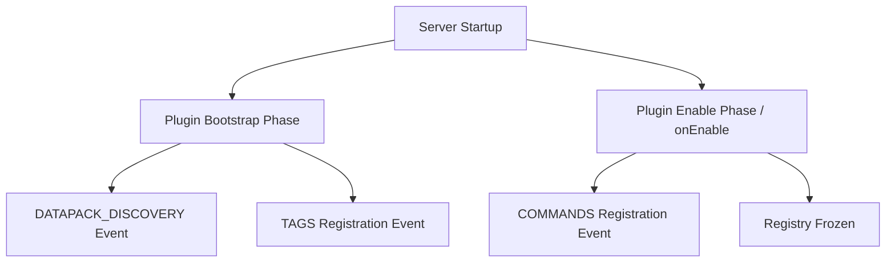

# Paper 26.1 API Catalog & Developer Reference Manual
**Minecraft version compatibility:** 1.21.1 / 1.21.3+ (Paper weights/NMS changes)

This document is a comprehensive catalog of all Paper 26.1 API features, registry patterns, lifecycle mechanics, data components, entity types, materials, and events. It serves as a deep technical reference for plugin developers working on Paper-based servers.

---

## Table of Contents
1. [Plugin Lifecycle Events API](#1-plugin-lifecycle-events-api)
2. [Registry Modification & Entry API](#2-registry-modification--entry-api)
3. [Item Data Components API](#3-item-data-components-api)
4. [Entity Types & Custom Variants Catalog](#4-entity-types--custom-variants-catalog)
5. [Material & Block Reference](#5-material--block-reference)
6. [Paper-Exclusive Event Catalog](#6-paper-exclusive-event-catalog)

---

## 1. Plugin Lifecycle Events API
Paper 26.1 introduces a modular bootstrap and lifecycle event pipeline (`io.papermc.paper.plugin.lifecycle.event.*`). This system separates plugin loading and registration into distinct server phases, allowing plugins to interact with Brigadier, Datapacks, and Tags before the world loads or the main tick loop begins.

### Lifecycle Phases & Flow


### Core Lifecycle Events
All lifecycle events are declared in the `io.papermc.paper.plugin.lifecycle.event.types.LifecycleEvents` class as static `LifecycleEventType` fields:

| Field Name | Phase | Registrar Type / Context | Purpose |
| :--- | :--- | :--- | :--- |
| `COMMANDS` | Bootstrap or Enable | `ReloadableRegistrarEvent<Commands>` | Registration of commands to the server's Brigadier command system. |
| `TAGS` | Bootstrap Only | `TagEventTypeProvider` | Registration of custom tags (blocks, items, biomes, etc.) to the tag system. |
| `DATAPACK_DISCOVERY` | Bootstrap Only | `RegistrarEvent<DatapackRegistrar>` | Informing the server of virtual/custom datapacks contained in plugin jars. |

### API Implementation Patterns

#### Implementing `PluginBootstrap`
To use bootstrap-level events, plugins must implement `io.papermc.paper.plugin.bootstrap.PluginBootstrap` and declare it in their `paper-plugin.yml`.

```java
package my.plugin;

import io.papermc.paper.plugin.bootstrap.BootstrapContext;
import io.papermc.paper.plugin.bootstrap.PluginBootstrap;
import io.papermc.paper.plugin.lifecycle.event.LifecycleEventManager;
import io.papermc.paper.plugin.lifecycle.event.types.LifecycleEvents;
import org.jetbrains.annotations.NotNull;

public class MyPluginBootstrap implements PluginBootstrap {
    @Override
    public void bootstrap(@NotNull BootstrapContext context) {
        LifecycleEventManager<BootstrapContext> manager = context.getLifecycleManager();

        // 1. Register Datapack Discovery Handler
        manager.registerEventHandler(LifecycleEvents.DATAPACK_DISCOVERY, event -> {
            // Register plugin-bundled datapacks here
        });

        // 2. Register Custom Tags
        manager.registerEventHandler(LifecycleEvents.TAGS.postFlat(RegistryKey.BLOCK), event -> {
            // Register blocks to tags
        });
    }
}
```

#### Registering Brigadier Commands (`onEnable`)
Commands can be registered during the main enable phase using the modern Brigadier API.

```java
package my.plugin;

import com.mojang.brigadier.builder.LiteralArgumentBuilder;
import io.papermc.paper.command.brigadier.CommandSourceStack;
import io.papermc.paper.command.brigadier.Commands;
import io.papermc.paper.plugin.lifecycle.event.LifecycleEventManager;
import io.papermc.paper.plugin.lifecycle.event.types.LifecycleEvents;
import net.kyori.adventure.text.Component;
import org.bukkit.plugin.Plugin;
import org.bukkit.plugin.java.JavaPlugin;

public final class MyPlugin extends JavaPlugin {
    @Override
    public void onEnable() {
        LifecycleEventManager<Plugin> manager = this.getLifecycleManager();

        manager.registerEventHandler(LifecycleEvents.COMMANDS, event -> {
            final Commands commands = event.registrar();
            
            // Register a Brigadier command
            commands.register(
                Commands.literal("hello")
                    .executes(ctx -> {
                        ctx.getSource().getSender().sendMessage(Component.text("Hello from Paper 26.1!"));
                        return 1; // Command success
                    })
                    .build(),
                "Primary hello command description",
                java.util.List.of("hi", "hey") // Aliases
            );
        });
    }
}
```

---

## 2. Registry Modification & Entry API
Paper 26.1 transitions the server to an extensive data-driven and built-in registry system managed under `io.papermc.paper.registry.*`.

### Registry Keys (`RegistryKey<T>`)
Every registry on the server is uniquely identified by a `RegistryKey`. There are two classifications:
*   **Built-in:** Loaded first, immutable at runtime via datapacks.
*   **Data-driven:** Created or loaded by reading vanilla and custom datapacks.

Here is the complete catalog of all `RegistryKey` constants in Paper 26.1:

| Key Field | Value Interface / Class | Type |
| :--- | :--- | :--- |
| `ATTRIBUTE` | `org.bukkit.attribute.Attribute` | Built-in |
| `BLOCK` | `org.bukkit.block.BlockType` | Built-in |
| `DATA_COMPONENT_TYPE` | `io.papermc.paper.datacomponent.DataComponentType` | Built-in |
| `ENTITY_TYPE` | `org.bukkit.entity.EntityType` | Built-in |
| `FLUID` | `org.bukkit.Fluid` | Built-in |
| `GAME_EVENT` | `org.bukkit.GameEvent` | Built-in |
| `GAME_RULE` | `org.bukkit.GameRule<?>` | Built-in |
| `ITEM` | `org.bukkit.inventory.ItemType` | Built-in |
| `MAP_DECORATION_TYPE` | `org.bukkit.map.MapCursor.Type` | Built-in |
| `MEMORY_MODULE_TYPE` | `org.bukkit.entity.memory.MemoryKey<?>` | Built-in |
| `MENU` | `org.bukkit.inventory.MenuType` | Built-in |
| `MOB_EFFECT` | `org.bukkit.potion.PotionEffectType` | Built-in |
| `PARTICLE_TYPE` | `org.bukkit.Particle` | Built-in |
| `POINT_OF_INTEREST_TYPE` | `io.papermc.paper.entity.poi.PoiType` | Built-in |
| `POTION` | `org.bukkit.potion.PotionType` | Built-in |
| `SOUND_EVENT` | `org.bukkit.Sound` | Built-in |
| `STRUCTURE_TYPE` | `org.bukkit.generator.structure.StructureType` | Built-in |
| `VILLAGER_PROFESSION` | `org.bukkit.entity.Villager.Profession` | Built-in |
| `VILLAGER_TYPE` | `org.bukkit.entity.Villager.Type` | Built-in |
| `BANNER_PATTERN` | `org.bukkit.block.banner.PatternType` | Data-driven |
| `BIOME` | `org.bukkit.block.Biome` | Data-driven |
| `CAT_SOUND_VARIANT` | `org.bukkit.entity.Cat.SoundVariant` | Data-driven |
| `CAT_VARIANT` | `org.bukkit.entity.Cat.Type` | Data-driven |
| `CHICKEN_SOUND_VARIANT`| `org.bukkit.entity.Chicken.SoundVariant` | Data-driven |
| `CHICKEN_VARIANT` | `org.bukkit.entity.Chicken.Variant` | Data-driven |
| `COW_SOUND_VARIANT` | `org.bukkit.entity.Cow.SoundVariant` | Data-driven |
| `COW_VARIANT` | `org.bukkit.entity.Cow.Variant` | Data-driven |
| `DAMAGE_TYPE` | `org.bukkit.damage.DamageType` | Data-driven |
| `DIALOG` | `io.papermc.paper.dialog.Dialog` | Data-driven |
| `ENCHANTMENT` | `org.bukkit.enchantments.Enchantment` | Data-driven |
| `FROG_VARIANT` | `org.bukkit.entity.Frog.Variant` | Data-driven |
| `INSTRUMENT` | `org.bukkit.MusicInstrument` | Data-driven |
| `JUKEBOX_SONG` | `org.bukkit.JukeboxSong` | Data-driven |
| `PAINTING_VARIANT` | `org.bukkit.Art` | Data-driven |
| `PIG_SOUND_VARIANT` | `org.bukkit.entity.Pig.SoundVariant` | Data-driven |
| `PIG_VARIANT` | `org.bukkit.entity.Pig.Variant` | Data-driven |
| `STRUCTURE` | `org.bukkit.generator.structure.Structure` | Data-driven |
| `TRIM_MATERIAL` | `org.bukkit.inventory.meta.trim.TrimMaterial` | Data-driven |
| `TRIM_PATTERN` | `org.bukkit.inventory.meta.trim.TrimPattern` | Data-driven |
| `WOLF_SOUND_VARIANT` | `org.bukkit.entity.Wolf.SoundVariant` | Data-driven |
| `WOLF_VARIANT` | `org.bukkit.entity.Wolf.Variant` | Data-driven |
| `ZOMBIE_NAUTILUS_VARIANT`| `org.bukkit.entity.ZombieNautilus.Variant`| Data-driven |

### Registry Events (`RegistryEvents`)
Plugins can modify, register, or inject custom data objects into specific registries prior to world generation or loading. Modification is handled via `RegistryEntryAddEvent` and `RegistryComposeEvent`.

The following registries support customization events via `io.papermc.paper.registry.event.RegistryEvents`:
*   `BANNER_PATTERN`
*   `CAT_VARIANT`
*   `CHICKEN_VARIANT`
*   `COW_VARIANT`
*   `DAMAGE_TYPE`
*   `DIALOG`
*   `ENCHANTMENT`
*   `FROG_VARIANT`
*   `GAME_EVENT`
*   `INSTRUMENT`
*   `JUKEBOX_SONG`
*   `PAINTING_VARIANT`
*   `PIG_VARIANT`
*   `WOLF_VARIANT`
*   `ZOMBIE_NAUTILUS_VARIANT`

#### Example: Registering a Custom Enchantment
```java
package my.plugin;

import io.papermc.paper.plugin.bootstrap.BootstrapContext;
import io.papermc.paper.plugin.bootstrap.PluginBootstrap;
import io.papermc.paper.registry.RegistryKey;
import io.papermc.paper.registry.TypedKey;
import io.papermc.paper.registry.data.EnchantmentRegistryEntry;
import io.papermc.paper.registry.event.RegistryEvents;
import net.kyori.adventure.key.Key;
import net.kyori.adventure.text.Component;
import org.bukkit.enchantments.Enchantment;
import org.jetbrains.annotations.NotNull;

public class RegistryBootstrap implements PluginBootstrap {
    @Override
    public void bootstrap(@NotNull BootstrapContext context) {
        // Enchantment registry changes must happen at bootstrap level
        context.getLifecycleManager().registerEventHandler(
            RegistryEvents.ENCHANTMENT.entryAdd(),
            event -> {
                TypedKey<Enchantment> myEnchKey = TypedKey.create(
                    RegistryKey.ENCHANTMENT, 
                    Key.key("myplugin", "lifesteal")
                );

                event.registry().register(
                    myEnchKey,
                    builder -> builder
                        .description(Component.text("Lifesteal"))
                        .supportedItems(event.registry().get(RegistryKey.ITEM).getTag(TagKey.create(RegistryKey.ITEM, Key.key("swords"))))
                        .anvilCost(4)
                        .maxLevel(3)
                        .minCost(EnchantmentRegistryEntry.Builder.Cost.of(10, 8))
                        .maxCost(EnchantmentRegistryEntry.Builder.Cost.of(50, 8))
                );
            }
        );
    }
}
```

---

## 3. Item Data Components API
Paper 26.1 fully replaces NBT-centric `ItemMeta` serialization with the **Data Component API** (`io.papermc.paper.datacomponent.*`). Under this system, all properties on an item (from its maximum stack size to entity details) are represented as statically typed components.

### Structure of Data Components
*   `DataComponentType`: Represents the key or metadata field.
*   `DataComponentType.Valued<T>`: A component that contains a value of type `T` (e.g. `MAX_STACK_SIZE` contains an `Integer`).
*   `DataComponentType.NonValued`: A marker component indicating a binary state (e.g. `GLIDER`).

### Complete List of Predefined Data Components
The `io.papermc.paper.datacomponent.DataComponentTypes` class exposes the following constants:

#### General Properties
*   `MAX_STACK_SIZE` (Integer): Stack limit (1-99).
*   `MAX_DAMAGE` (Integer): Max durability.
*   `DAMAGE` (Integer): Durability removed.
*   `UNBREAKABLE` (Unbreakable): Blocks durability loss.
*   `CUSTOM_NAME` (Component): Custom renamed item display string.
*   `ITEM_NAME` (Component): Overrides default item item-type name.
*   `ITEM_MODEL` (Key): Custom namespace path to JSON model.
*   `LORE` (ItemLore): String lines in the item tooltip.
*   `RARITY` (ItemRarity): Rarity color formatting.
*   `CUSTOM_MODEL_DATA` (CustomModelData): NBT replacement for model styling.
*   `ENCHANTMENT_GLINT_OVERRIDE` (Boolean): Enforces or disables glint animation.
*   `REPAIR_COST` (Integer): Prior anvil penalty penalty level.

#### Weapons, Tools & Projectiles
*   `ATTACK_RANGE` (AttackRange): Block distance for melee attacks.
*   `ATTRIBUTE_MODIFIERS` (ItemAttributeModifiers): Attributes applied while equipped.
*   `TOOL` (Tool): Mining speed and block breakdown multipliers.
*   `WEAPON` (Weapon): Flat attack damage details.
*   `ENCHANTMENTS` (ItemEnchantments): Map of enchantments on the item.
*   `STORED_ENCHANTMENTS` (ItemEnchantments): Enchantments inside an Enchanted Book.
*   `CAN_PLACE_ON` (ItemAdventurePredicate): Adventure placement restrictions.
*   `CAN_BREAK` (ItemAdventurePredicate): Adventure block break permissions.
*   `DAMAGE_RESISTANT` (DamageResistant): Damage tags this item ignores (e.g. fire).
*   `ENCHANTABLE` (Enchantable): Enchability value in enchanting table.
*   `EQUIPPABLE` (Equippable): Equipment slots this item can fit into.
*   `REPAIRABLE` (Repairable): Items that can repair this item in an anvil.
*   `GLIDER` (Marker): Enables elyting action.
*   `DEATH_PROTECTION` (DeathProtection): Totem-like properties.
*   `BLOCKS_ATTACKS` (BlocksAttacks): Shield block configuration.
*   `PIERCING_WEAPON` (Marker): Projectiles pierce entities.
*   `KINETIC_WEAPON` (Marker): Wind-charge style knockbacks.
*   `SWING_ANIMATION` (SwingAnimation): Animation style when clicked.
*   `INTANGIBLE_PROJECTILE` (Marker): Projectiles cannot be picked up.

#### Consumables & Utility
*   `FOOD` (FoodProperties): Nutritional value and status effect details.
*   `CONSUMABLE` (Consumable): Eat/drink timing, animations, sound events.
*   `USE_EFFECTS` (UseEffects): Actions triggered upon consumption.
*   `USE_REMAINDER` (ItemStack): Remaining item returned to inventory (e.g. Empty Bucket).
*   `USE_COOLDOWN` (UseCooldown): Cooldown ticks applied to the player.
*   `BUNDLE_CONTENTS` (BundleContents): Stored inventory inside a bundle.
*   `CONTAINER` (ItemContainerContents): Block inventories (e.g. chest/shulker contents).
*   `CONTAINER_LOOT` (SeededContainerLoot): Unresolved loot table references.
*   `RECIPES` (List of keys): Unlocked crafting recipes.
*   `WRITABLE_BOOK_CONTENT` (WritableBookContent): Pages inside a Book and Quill.
*   `WRITTEN_BOOK_CONTENT` (WrittenBookContent): Signed book title, author, and pages.
*   `JUKEBOX_PLAYABLE` (JukeboxPlayable): Song track reference.

#### Map & Decoration Properties
*   `MAP_COLOR` (MapItemColor): Tint applied to map markers.
*   `MAP_ID` (MapId): ID reference of the map canvas.
*   `MAP_DECORATIONS` (MapDecorations): Specific points/pins placed on maps.
*   `MAP_POST_PROCESSING` (MapPostProcessing): Internal map scaling indicator.
*   `FIREWORK_EXPLOSION` (FireworkEffect): Firework star blast.
*   `FIREWORKS` (Fireworks): Flight duration and list of explosions.
*   `LODESTONE_TRACKER` (LodestoneTracker): Magnetized coordinates of Lodestone Compasses.
*   `DYE` (DyeColor): General dye color.
*   `DYED_COLOR` (DyedItemColor): Leather armor RGB color overrides.
*   `TRIM` (ArmorTrim): Trim pattern and material.
*   `PROVIDES_TRIM_MATERIAL` (TrimMaterial): Smithing ingredient trim color.
*   `BANNER_PATTERNS` (BannerPatternLayers): List of overlapping layers.
*   `BASE_COLOR` (DyeColor): Shield base canvas color.
*   `POT_DECORATIONS` (List of pottery sherd keys): Decorated Pot faces.
*   `PROFILE` (PlayerProfile): Skin texture profile on Player Heads.
*   `NOTE_BLOCK_SOUND` (Key): Audio played when placed on Note Blocks.

#### Entity Variant Storage
*   `VILLAGER_VARIANT`, `WOLF_VARIANT`, `WOLF_SOUND_VARIANT`, `WOLF_COLLAR`
*   `FOX_VARIANT`, `SALMON_SIZE`, `PARROT_VARIANT`, `MOOSHROOM_VARIANT`
*   `RABBIT_VARIANT`, `PIG_VARIANT`, `PIG_SOUND_VARIANT`, `COW_VARIANT`
*   `COW_SOUND_VARIANT`, `CHICKEN_VARIANT`, `CHICKEN_SOUND_VARIANT`, `FROG_VARIANT`
*   `HORSE_VARIANT`, `PAINTING_VARIANT`, `LLAMA_VARIANT`, `AXOLOTL_VARIANT`
*   `ZOMBIE_NAUTILUS_VARIANT`, `CAT_VARIANT`, `CAT_SOUND_VARIANT`, `CAT_COLLAR`
*   `SHEEP_COLOR`, `SHULKER_COLOR`

---

## 4. Entity Types & Custom Variants Catalog
Paper 26.1 supports the standard vanilla entities alongside a set of custom, built-in entity types specific to the HouziCore runtime and vanilla testing.

### Full EntityType Catalog
*   `PLAYER`, `ARMOR_STAND`, `ITEM`, `EXPERIENCE_ORB`
*   `ALLAY`, `ARMADILLO`, `AXOLOTL`, `BAT`, `BEE`, `CAT`, `CHICKEN`, `COD`, `COW`, `DOLPHIN`, `DONKEY`, `FOX`, `FROG`, `GOAT`, `HORSE`, `LLAMA`, `MOOSHROOM`, `MULE`, `OCELOT`, `PANDA`, `PARROT`, `PIG`, `POLAR_BEAR`, `PUFFERFISH`, `RABBIT`, `SALMON`, `SHEEP`, `SNIFFER`, `SQUID`, `GLOW_SQUID`, `TADPOLE`, `TROPICAL_FISH`, `TURTLE`, `WOLF`
*   `BLAZE`, `CAVE_SPIDER`, `CREEPER`, `DROWNED`, `ELDER_GUARDIAN`, `ENDERMAN`, `ENDERMITE`, `EVOKER`, `GHAST`, `GUARDIAN`, `HOGLIN`, `HUSK`, `ILLUSIONER`, `MAGMA_CUBE`, `PIGLIN`, `PIGLIN_BRUTE`, `PILLAGER`, `RAVAGER`, `SHULKER`, `SILVERFISH`, `SKELETON`, `SKELETON_HORSE`, `SLIME`, `SPIDER`, `STRAY`, `STRIDER`, `VEX`, `VILLAGER`, `VINDICATOR`, `WANDERING_TRADER`, `WARDEN`, `WITCH`, `WITHER`, `WITHER_SKELETON`, `ZOGLIN`, `ZOMBIE`, `ZOMBIE_HORSE`, `ZOMBIE_VILLAGER`, `ZOMBIFIED_PIGLIN`
*   `BREEZE`, `BOGGED` *(1.21 Trial Chamber Entities)*
*   `CREAKING` *(1.21.3 Pale Garden Entity)*
*   `AREA_EFFECT_CLOUD`, `BLOCK_DISPLAY`, `ITEM_DISPLAY`, `TEXT_DISPLAY`, `INTERACTION`, `MARKER`
*   `DRAGON_FIREBALL`, `FIREBALL`, `SMALL_FIREBALL`, `WIND_CHARGE`, `BREEZE_WIND_CHARGE`, `WITHER_SKULL`
*   `ARROW`, `SPECTRAL_ARROW`, `TRIDENT`, `EGG`, `ENDER_PEARL`, `EXPERIENCE_BOTTLE`, `EYE_OF_ENDER`, `FIREWORK_ROCKET`, `FISHING_BOBBER`, `LINGERING_POTION`, `SHULKER_BULLET`, `SNOWBALL`, `SPLASH_POTION`
*   `BOAT`, `CHEST_BOAT` (Variants: `OAK`, `SPRUCE`, `BIRCH`, `JUNGLE`, `ACACIA`, `DARK_OAK`, `MANGROVE`, `CHERRY`, `BAMBOO_RAFT`, `BAMBOO_CHEST_RAFT`, `PALE_OAK`)
*   `MINECART`, `CHEST_MINECART`, `COMMAND_BLOCK_MINECART`, `FURNACE_MINECART`, `HOPPER_MINECART`, `SPAWNER_MINECART`, `TNT_MINECART`
*   `ENDER_DRAGON`, `END_CRYSTAL`, `EVOKER_FANGS`, `FALLING_BLOCK`, `LIGHTNING_BOLT`, `PAINTING`, `TNT`, `LEASH_KNOT`, `ITEM_FRAME`, `GLOW_ITEM_FRAME`
*   **Custom/Special Types:**
    *   `COPPER_GOLEM`
    *   `HAPPY_GHAST`
    *   `MANNEQUIN`
    *   `NAUTILUS`
    *   `PARCHED`
    *   `ZOMBIE_NAUTILUS`
*   `UNKNOWN`

---

## 5. Material & Block Reference
New blocks, items, and specialized decoration types are available in Paper 26.1, including Trial Chamber and Pale Garden variants.

### Key Material Additions (1.21 / 1.21.3)
*   **Trial Chambers:** `TRIAL_KEY`, `OMINOUS_TRIAL_KEY`, `OMINOUS_BOTTLE`, `TRIAL_SPAWNER`, `VAULT`, `MACE`, `BREEZE_ROD`, `WIND_CHARGE`, `HEAVY_CORE`.
*   **Pale Garden Wood & Items:** `PALE_OAK_LOG`, `PALE_OAK_PLANKS`, `PALE_OAK_SAPLING`, `PALE_OAK_LEAVES`, `PALE_OAK_BOAT`, `PALE_OAK_CHEST_BOAT`, `PALE_OAK_SIGN`, `PALE_OAK_HANGING_SIGN`.
*   **Resin Mechanics:** `RESIN_CLUMP`, `RESIN_BRICK`, `RESIN_BRICKS`, `RESIN_BRICK_SLAB`, `RESIN_BRICK_STAIRS`, `RESIN_BRICK_WALL`, `CHISELED_RESIN_BRICKS`.
*   **Armor Trims:** `FLOW_ARMOR_TRIM_SMITHING_TEMPLATE`, `BOLT_ARMOR_TRIM_SMITHING_TEMPLATE`.
*   **Custom Furniture Blocks:**
    *   `ACACIA_SHELF`, `BAMBOO_SHELF`, `BIRCH_SHELF`, `CHERRY_SHELF`, `DARK_OAK_SHELF`, `JUNGLE_SHELF`, `MANGROVE_SHELF`, `OAK_SHELF`, `PALE_OAK_SHELF`, `SPRUCE_SHELF` (custom horizontal storage blocks).

---

## 6. Paper-Exclusive Event Catalog
Paper adds a substantial layer of custom events on top of Bukkit/Spigot for optimal performance management and deep packet/entity mechanics control.

### Block Events (`io.papermc.paper.event.block`)
*   `BeaconActivateEvent`: Triggered when a Beacon is powered up.
*   `BeaconDeactivateEvent`: Triggered when a Beacon loses its structure.
*   `BlockBreakBlockEvent`: A block breaks another block (e.g. piston pushing block into cactus).
*   `BlockFailedDispenseEvent`: Dispenser attempts to fire but fails (empty or obstructed).
*   `BellRingEvent`: Triggered when a bell is rung by a player or projectile.
*   `TNTPrimeEvent`: Raised when TNT is about to explode due to fire, redstone, or impact.

### Entity Events (`io.papermc.paper.event.entity`)
*   `EntityDamageItemEvent`: An entity takes damage that reduces item durability (e.g., armor damage).
*   `EntityDyeEvent`: An entity (like a Sheep) is colored with dye.
*   `EntityInsideBlockEvent`: Triggered every tick an entity intersects a damaging/interactive block (sweet berry bushes, fire).
*   `EntityMoveEvent`: High-performance movement event for non-player entities.
*   `EntityToggleSitEvent`: Triggered when an entity toggles its sitting state (dogs, cats, camels).
*   `WardenAngerChangeEvent`: Triggered when a Warden's frustration value towards a target entity changes.

### Player Events (`io.papermc.paper.event.player`)
*   `PlayerArmSwingEvent`: Fires when a player swings their hand (client packet listener).
*   `PlayerAttackEntityCooldownResetEvent`: Raised when a player performs an attack, resetting the swing cooldown.
*   `PlayerDeepSleepEvent`: Fires when a player completes the sleep cycle.
*   `PlayerInventorySlotChangeEvent`: Fires when a player changes items in any slot, including active armor or off-hand.
*   `PlayerNameEntityEvent`: Triggered when a player applies a Name Tag to an entity.
*   `PlayerPurchaseEvent`: Triggered when a player clicks a villager trade recipe slot.
*   `PlayerReadyArrowEvent`: Triggered when a player draws back a bow/crossbow projectile.

### World Events (`io.papermc.paper.event.world`)
*   `StructureLocateEvent`: Fired when a command or structure compass attempts to locate a structure.
*   `WorldGameRuleChangeEvent`: Raised when a gamerule value is modified.

### Server Events (`io.papermc.paper.event.server`)
*   `ServerResourcesReloadedEvent`: Fires after `/minecraft:reload` finishes loading datapacks and functions.
*   `WhitelistToggleEvent`: Raised when the whitelist status is toggled on the console or in-game.

### Packet & Network Events (`io.papermc.paper.event.packet` & `io.papermc.paper.event.connection`)
*   `PlayerFailMoveEvent`: Fires when a player moves illegally (triggers "moved too quickly" or "moved wrongly" kick checks).
